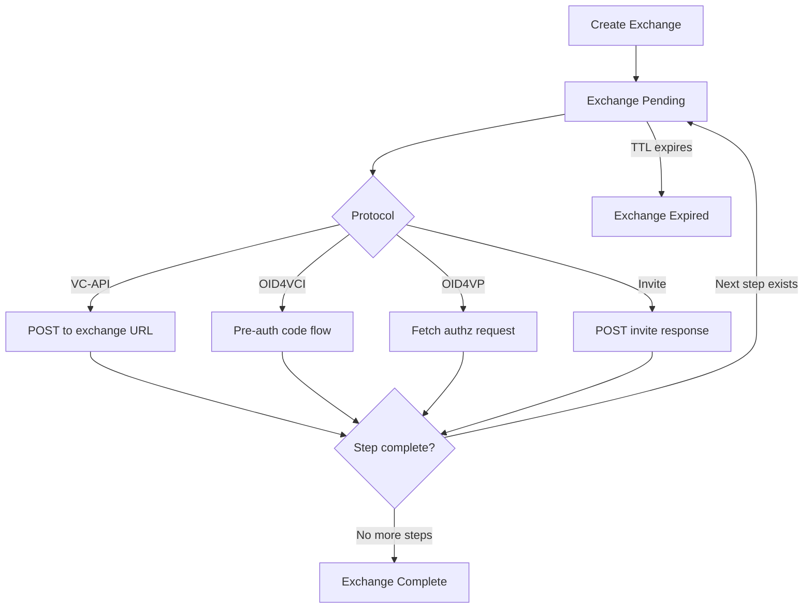

# @bedrock/vc-delivery

A [Bedrock][] module that provides a **Verifiable Credential (VC) Workflow
Service** for issuing and exchanging VCs using multiple protocols. It enables
configurable, multi-step credential exchange workflows with support for the
VC-API, OpenID for Verifiable Credential Issuance (OID4VCI), OpenID for
Verifiable Presentations (OID4VP), and an Invite Request protocol.

## Table of Contents

- [Background](#background)
- [Features](#features)
- [Requirements](#requirements)
- [Installation](#installation)
- [Quick Start](#quick-start)
- [Configuration](#configuration)
  - [Workflow Config](#workflow-config)
  - [Credential Templates](#credential-templates)
  - [Steps](#steps)
  - [Issuer Instances](#issuer-instances)
  - [OID4VCI Options](#oid4vci-options)
  - [OID4VP Client Profiles](#oid4vp-client-profiles)
- [HTTP API](#http-api)
  - [Exchanges](#exchanges)
  - [Protocols](#protocols)
  - [OID4VCI Endpoints](#oid4vci-endpoints)
  - [OID4VP Endpoints](#oid4vp-endpoints)
  - [Invite Request Endpoints](#invite-request-endpoints)
- [Protocols](#supported-protocols)
  - [VC-API](#vc-api)
  - [OID4VCI](#oid4vci)
  - [OID4VP](#oid4vp)
  - [Invite Request](#invite-request)
- [Exchange Lifecycle](#exchange-lifecycle)
- [Multi-Step Workflows](#multi-step-workflows)
- [Security](#security)
- [Backwards Compatibility](#backwards-compatibility)
- [License](#license)

## Background

This module implements the server-side infrastructure for **Verifiable Credential
delivery**. A *workflow* is a reusable configuration that defines how credentials
are issued and/or verified. An *exchange* is a single instance of that workflow —
a live, stateful session between a workflow service and an exchange client (e.g.
a digital wallet).

Workflows are registered with an associated set of authorization capabilities
(zcaps) that grant the service permission to issue and verify credentials on
behalf of the workflow owner.

## Features

- **Multi-protocol support**: VC-API, OID4VCI v1.0, OID4VP 1.0, and Invite
  Request (with backwards compatibility for OID4VCI Draft 13 and OID4VP Draft
  18).
- **Multi-step exchanges**: Define sequential steps that mix presentation
  verification and credential issuance within a single exchange.
- **JSONata credential templates**: Dynamically generate credential content
  from exchange variables using [JSONata][] expressions.
- **Multiple issuer instances**: Configure up to 10 independent issuer
  instances per workflow, each with its own zcap and supported credential
  formats.
- **OID4VP client profiles**: Configure up to 10 OID4VP client profiles per
  workflow, including support for signed authorization requests and mDL/ISO
  18013-7 presentation flows.
- **OAuth2 / zcap authorization**: Workflow management endpoints support both
  zcap-based and OAuth2-based authorization.
- **Configurable exchange TTL**: Exchanges expire automatically (default 15
  minutes, maximum 48 hours).

## Requirements

- Node.js >= 20
- MongoDB (via [`@bedrock/mongodb`][])
- A running [Bedrock][] application with the required peer dependencies (see
  `peerDependencies` in `package.json`)


## Installation

```sh
npm install @bedrock/vc-delivery
```

Then import the module in your Bedrock application entry point:

```js
import '@bedrock/vc-delivery';
```

The module self-registers with Bedrock on import and will set up all routes
and storage on startup.

## Quick Start

### 1. Create a workflow configuration

```js
// POST /workflows
{
  "sequence": 0,
  "controller": "did:key:z6Mk...",
  "credentialTemplates": [{
    "type": "jsonata",
    "template": "{ '@context': ['https://www.w3.org/2018/credentials/v1'], 'type': ['VerifiableCredential'], 'credentialSubject': {'id': subject} }"
  }],
  "initialStep": "issue",
  "steps": {
    "issue": {
      "issueRequests": [{ "credentialTemplateIndex": 0 }]
    }
  },
  "zcaps": {
    "issue": { /* delegated issue zcap */ }
  }
}
```

### 2. Create an exchange

```js
// POST /workflows/:workflowId/exchanges
{
  "ttl": 900,
  "variables": {
    "subject": "did:example:holder123"
  }
}
// Response: 204 No Content; Location header contains exchange URL
```

### 3. Execute the exchange (VC-API)

```js
// POST /workflows/:workflowId/exchanges/:exchangeId
{}
// Response:
{
  "verifiablePresentation": { /* VP containing issued VCs */ }
}
```

## Configuration

### Workflow Config

Workflows are created and managed via the [`@bedrock/service-core`][] HTTP
API at `/workflows`. The configuration body accepts the following custom
properties in addition to standard service-core fields:

| Property | Type | Required | Description |
|----------|------|----------|-------------|
| `credentialTemplates` | Array | No | List of JSONata credential templates to issue |
| `steps` | Object | No | Named step definitions for multi-step exchanges |
| `initialStep` | String | Required if `steps` present | Name of the first step to execute |
| `issuerInstances` | Array | No | Up to 10 issuer instance configurations |
| `zcaps` | Object | No | Authorization capability references |

If `credentialTemplates` are provided, either a top-level `zcaps.issue`
or at least one `issuerInstances` entry with its own issue zcap is required.

### Credential Templates

Credential templates use [JSONata][] to dynamically produce credential JSON.
Exchange `variables` and built-in `globals` are available as template
bindings.

```js
"credentialTemplates": [{
  "type": "jsonata",
  "id": "myTemplate",           // optional, for referencing in issueRequests
  "template": "{ ... }"         // JSONata expression returning a VC object
}]
```

**Built-in template globals:**

| Variable | Description |
|----------|-------------|
| `globals.exchange.id` | The local exchange ID |
| `globals.exchangeId` | The full exchange URL |
| `globals.workflow.id` | The workflow ID |

### Steps

Steps define the interactive logic of an exchange. Each step can request a
Verifiable Presentation, issue credentials, or both.

```js
"steps": {
  "verify": {
    "verifiablePresentationRequest": { /* VPR object */ },
    "nextStep": "issue"
  },
  "issue": {
    "issueRequests": [
      { "credentialTemplateIndex": 0 }
    ]
  }
},
"initialStep": "verify"
```

**Step fields:**

| Field | Description |
|-------|-------------|
| `issueRequests` | Array of credential issue request parameters |
| `verifiablePresentationRequest` | VPR to send to the client |
| `verifiablePresentation` | VP to return immediately without client input |
| `createChallenge` | `true` to generate and attach a challenge nonce to the VPR |
| `nextStep` | Name of the step to transition to after this one completes |
| `openId` | OID4VP options for this step |
| `jwtDidProofRequest` | Request a DID-bound JWT proof |
| `divpDidProofRequest` | Request a DI-VP DID proof |
| `callback.url` | URL to call when exchange state updates |
| `presentationSchema` | JSON Schema to validate received presentations |
| `verifyPresentationOptions` | Additional options for presentation verification |
| `verifyPresentationResultSchema` | JSON Schema to validate verification results |
| `allowUnprotectedPresentation` | Allow presentations without a proof |
| `redirectUrl` | URL to redirect the exchange client upon completion |

Steps may also be defined as **templated steps**, where a JSONata
`stepTemplate` expression dynamically generates the step configuration from
exchange variables at runtime:

```js
"steps": {
  "dynamic": {
    "stepTemplate": {
      "type": "jsonata",
      "template": "{ 'issueRequests': [{ 'credentialTemplateIndex': 0 }] }"
    }
  }
}
```

### Issuer Instances

`issuerInstances` allows a workflow to configure multiple issuers, each with
different capabilities and supported credential media types. Up to 10 instances
are supported.

```js
"issuerInstances": [{
  "id": "myIssuer",                         // optional identifier
  "supportedMediaTypes": ["application/vc"],
  "zcapReferenceIds": {
    "issue": "myIssuerZcap"
  },
  "oid4vci": {
    "supportedCredentialConfigurations": {  // optional explicit OID4VCI config
      "MyCredential_ldp_vc": { /* credential configuration */ }
    }
  }
}]
```

Each issuer instance references a zcap in the workflow's `zcaps` map by its
`zcapReferenceIds.issue` key.

### OID4VCI Options

When creating an exchange with OID4VCI support, pass an `openId` object in the
exchange creation body:

```js
// POST /workflows/:workflowId/exchanges
{
  "openId": {
    "preAuthorizedCode": "abc123",
    "oauth2": {
      "generateKeyPair": { "algorithm": "ES256" }
      // or provide an existing key pair:
      // "keyPair": { "privateKeyJwk": {...}, "publicKeyJwk": {...} }
    }
  }
}
```

> **Deprecated:** `expectedCredentialRequests` is deprecated and should not be
> used in new workflows. Credential configurations are inferred from
> `issuerInstances` instead.

### OID4VP Client Profiles

OID4VP client profiles allow fine-grained control over how authorization
requests are constructed and which wallet/verifier protocols are used. Up to 10
profiles are supported per workflow step.

```js
// in a step:
"openId": {
  "clientProfiles": {
    "myProfile": {
      "createAuthorizationRequest": "/authzReqVar",
      "client_id": "https://verifier.example",
      "client_id_scheme": "redirect_uri",
      "response_mode": "direct_post",
      "response_uri": "https://verifier.example/callback",
      "protocolUrlParameters": {
        "name": "OID4VP",
        "scheme": "openid4vp",
        "version": "OID4VP-1.0"   // or "OID4VP-draft18"
      }
    }
  }
}
```

> **Deprecated:** `presentation_definition` (Presentation Exchange) is a
> pre-OID4VP 1.0 mechanism and is deprecated. Prefer `dcql_query` for new
> implementations.

Supported `response_mode` values include `direct_post`, `direct_post.jwt`,
`dc_api`, and `dc_api.jwt`.

## HTTP API

All endpoints support CORS. Authorization uses zcaps or OAuth2 — not cookies
— so CSRF is not a concern.

### Exchanges

#### Create Exchange

```
POST /workflows/:workflowId/exchanges
```

**Body** (`application/json`):

| Field | Type | Description |
|-------|------|-------------|
| `ttl` | Number | Seconds until expiry (default: 900, max: 172800) |
| `expires` | String | ISO 8601 expiry date (alternative to `ttl`) |
| `variables` | Object | Key/value pairs available in credential templates and step templates |
| `openId` | Object | OID4VCI configuration (see [OID4VCI Options](#oid4vci-options)) |

> **Note:** The schema uses `additionalProperties: false`; fields not listed above (including `step`) will be rejected by the validator.

**Response**: `204 No Content` with a `Location` header pointing to the exchange URL.

#### Get Exchange

```
GET /workflows/:workflowId/exchanges/:exchangeId
```

Returns the current exchange state. Private keys and secrets are never
included in the response.

#### Use Exchange (VC-API)

```
POST /workflows/:workflowId/exchanges/:exchangeId
```

**Body** (`application/json`):

| Field | Type | Description |
|-------|------|-------------|
| `verifiablePresentation` | Object | VP to submit (if requested by the current step) |

**Response**: A JSON object, which may contain:
- `verifiablePresentation` — a VP with issued credentials
- `verifiablePresentationRequest` — a VPR requiring the client to submit a VP

### Protocols

#### Get Supported Protocols

```
GET /workflows/:workflowId/exchanges/:exchangeId/protocols
```

Returns a `{"protocols": {...}}` object listing all interaction URLs supported
by the exchange. Key names are:
- `vcapi` — always this literal string when VC-API is supported
- `inviteRequest` — always this literal string when an invite request step is active
- OID4VCI — always `OID4VCI`
- OID4VP — defaults to `OID4VP` but is controlled by the `protocolUrlParameters.name`
  field on each OID4VP client profile, so named profiles may produce arbitrary keys
  (e.g. a profile with `"name": "bar"` produces a `bar` key)

### OID4VCI Endpoints

The well-known metadata endpoints are served at **two URL shapes** for maximum
wallet compatibility:

| Method | Path | Description |
|--------|------|-------------|
| `GET` | `/.well-known/openid-credential-issuer/workflows/:wfId/exchanges/:id` | Credential issuer metadata (prefix form) |
| `GET` | `/workflows/:wfId/exchanges/:id/.well-known/openid-credential-issuer` | Credential issuer metadata (suffix form) |
| `GET` | `/.well-known/oauth-authorization-server/workflows/:wfId/exchanges/:id` | AS metadata (prefix form) |
| `GET` | `/workflows/:wfId/exchanges/:id/.well-known/oauth-authorization-server` | AS metadata (suffix form) |
| `GET` | `…/exchanges/:id/openid/credential-offer` | Credential offer object |
| `POST` | `…/exchanges/:id/openid/token` | Access token endpoint |
| `POST` | `…/exchanges/:id/openid/credential` | Credential request endpoint |
| `POST` | `…/exchanges/:id/openid/batch_credential` | Batch credential requests |
| `GET` | `…/exchanges/:id/openid/jwks` | JSON Web Key Set |
| `POST` | `…/exchanges/:id/openid/nonce` | Nonce endpoint |

### OID4VP Endpoints

Legacy (no client profile ID) and modern (with client profile ID) routes are
both supported:

| Method | Path | Description |
|--------|------|-------------|
| `GET/POST` | `…/exchanges/:id/openid/client/authorization/request` | Retrieve authorization request (default profile) |
| `POST` | `…/exchanges/:id/openid/client/authorization/response` | Submit authorization response (default profile) |
| `GET/POST` | `…/exchanges/:id/openid/clients/:clientProfileId/authorization/request` | Retrieve authorization request (named profile) |
| `POST` | `…/exchanges/:id/openid/clients/:clientProfileId/authorization/response` | Submit authorization response (named profile) |

### Invite Request Endpoints

| Method | Path | Description |
|--------|------|-------------|
| `POST` | `…/exchanges/:id/invite-request/response` | Submit invite response |

## Supported Protocols

### VC-API

The [VC-API][] protocol is automatically supported for any workflow that has
`credentialTemplates`, or for any step that has a
`verifiablePresentationRequest` or `verifiablePresentation`. The exchange URL
itself serves as the `vcapi` interaction endpoint.

### OID4VCI

[OpenID for Verifiable Credential Issuance][OID4VCI-spec] is supported when
an exchange is created with an `openId` configuration object. Supported grant
types:

- Pre-authorized code flow (`urn:ietf:params:oauth:grant-type:pre-authorized_code`)

Supported proof types for credential requests:

- `jwt` (JWT-based DID proof)
- `di_vp` (Data Integrity VP DID proof)

Supported credential formats (OID4VCI v1.0):

- `ldp_vc` / `application/vc` (JSON-LD Verifiable Credential)
- `jwt_vc_json` / `application/jwt` (JWT Verifiable Credential)

Supported for backwards compatibility with OID4VCI Draft 13 (deprecated):

- `jwt_vc_json-ld` (JSON-LD-based VC-JWT envelope)

> **Deprecated:** OID4VCI Draft 13 credential request formats are supported
> for backwards compatibility but are deprecated. New implementations should
> use OID4VCI v1.0.

### OID4VP

[OpenID for Verifiable Presentations][OID4VP-spec] is supported when a step
includes an `openId` configuration. The module supports:

- OID4VP 1.0+ (with prefixed `client_id` schemes and `request_uri_method=post`)
- Signed authorization requests (via `authorizationRequestSigningParameters`)
- Multiple response modes: `direct_post`, `direct_post.jwt`, `dc_api`, `dc_api.jwt`
- mDL / ISO 18013-7 presentations (Annex B, C, and D handover types)
- DCQL queries (`dcql_query`)

Supported for backwards compatibility (deprecated):

- OID4VP Draft 18
- Presentation Definitions (`presentation_definition`)

### Invite Request

A lightweight invite-based protocol. When a step exposes an `inviteRequest`
property, the exchange will include an `inviteRequest` URL in its `protocols`
response. The client POSTs an invite response (containing a `url`, `purpose`,
and optional `referenceId`) to complete this step.

Because the static `computedStep` schema does not declare an `inviteRequest`
property (it uses `additionalProperties: false`), the property must be injected
at runtime via a `stepTemplate` rather than declared directly in the workflow
configuration:

```js
"steps": {
  "myStep": {
    "stepTemplate": {
      "type": "jsonata",
      "template": "{ \"inviteRequest\": inviteRequest }"
    }
  }
}
```

The exchange variable `inviteRequest` must be set to `true` when creating the
exchange to activate the invite request protocol for that step.

## Exchange Lifecycle



Exchanges are stored in MongoDB. By default they expire after **15 minutes**
(`ttl: 900`). The maximum TTL is **48 hours** (`ttl: 172800`). Expired
exchanges are retained for an additional grace period of 3 days before being
eligible for removal.

Exchange `variables` hold the mutable state that flows between steps, including
per-step results accessible at `variables.results[stepName]`.

## Multi-Step Workflows

A workflow can chain multiple steps using the `nextStep` field. This enables
patterns such as:

1. **Verify then Issue** — Require the holder to present an existing credential
   before receiving a new one.
2. **OID4VP then OID4VCI** — Verify via OID4VP and then issue via OID4VCI in
   the same exchange session.
3. **Invite then Issue** — Collect wallet/app metadata via invite request
   before issuing credentials.

Step results are stored in `exchange.variables.results[stepName]` and are
accessible in subsequent JSONata step templates or credential templates.

## Security

- Workflow management routes require **zcap** or **OAuth2** authorization.
- Exchange execution routes (VC-API `POST`) are unauthenticated by design
  for OID4* protocol compatibility, but exchanges are single-use, short-lived,
  and scoped to a specific workflow.
- CORS is enabled on all endpoints. This is safe because authorization is
  performed using HTTP signatures and capabilities (not cookies), making CSRF
  impossible.
- Private key material (`privateKeyJwk`) and exchange `secrets` are stripped
  from all API responses.
- VC-API exchange creation and exchange-use payloads are limited to **10 MB** (configured via `config.express.bodyParser.routes`). OID4VP authorization-response form posts are also limited to **10 MB** (via an inline `urlencoded` body parser). Other OID4VCI endpoints (token, credential, etc.) rely on the framework's default body-size limits.

## Backwards Compatibility

This module previously exposed a `vc-exchanger` service at `/exchangers`. That
service type and route prefix are still registered as aliases and will continue
to function, but new deployments should use `vc-workflow` and `/workflows`.

## License

[New BSD License](LICENSE.md) © 2022-2026 Digital Bazaar, Inc.

[Bedrock]: https://github.com/digitalbazaar/bedrock
[JSONata]: https://jsonata.org
[VC-API]: https://w3c-ccg.github.io/vc-api/
[OID4VCI-spec]: https://openid.net/specs/openid-4-verifiable-credential-issuance-1_0.html
[OID4VP-spec]: https://openid.net/specs/openid-4-verifiable-presentations-1_0.html
[`@bedrock/mongodb`]: https://github.com/digitalbazaar/bedrock-mongodb
[`@bedrock/service-core`]: https://github.com/digitalbazaar/bedrock-service-core
